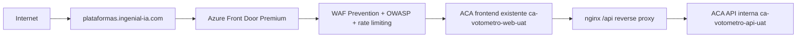

# Azure Front Door Premium UAT - Votometro

## Diagnostico inicial

Fecha de auditoria: 2026-05-25.

Subscription activa:

- Tenant: Ingenial IA SAS
- Tenant ID: `c2d119db-046d-490b-b428-ddef4bbd279a`
- Subscription: `Azure subscription 1`
- Subscription ID: `2c956f90-7b98-4d3d-9af9-5c28158644a8`

Estado actual validado:

- Frontend ACA: `ca-votometro-web-uat`
- Frontend FQDN: `ca-votometro-web-uat.whitesea-d6c244aa.eastus2.azurecontainerapps.io`
- Frontend ingress: publico, `targetPort=8080`, `allowInsecure=false`
- Frontend origin runtime: nginx unprivileged, `API_UPSTREAM` apunta a la API interna
- Backend ACA: `ca-votometro-api-uat`
- Backend FQDN: `ca-votometro-api-uat.internal.whitesea-d6c244aa.eastus2.azurecontainerapps.io`
- Backend ingress: interno, `external=false`, `targetPort=7071`
- Smoke actual:
  - `GET /` sobre ACA frontend: `200 text/html`
  - `GET /api/health` via ACA frontend: `200 application/json; charset=utf-8`

Hallazgos:

- No existe ningun `Microsoft.Cdn/profiles` en `rg-votometro-uat`.
- Provider `Microsoft.Cdn` esta `NotRegistered`.
- `plataformas.ingenial-ia.com` actualmente resuelve como `A 148.113.168.53`; no apunta a Azure Front Door.
- Azure CLI local tiene extensiones con errores de permisos en el perfil de usuario. El script usa `AZURE_EXTENSION_DIR` temporal para aislar extensiones y evitar el problema.

## Arquitectura objetivo



## Recursos nuevos propuestos

- Front Door profile: `afd-votometro-uat`
- Front Door endpoint: `afd-votometro-uat`
- Origin group: `og-votometro-web-uat`
- Origin: `origin-aca-web-uat`
- Route: `route-votometro-web-uat`
- Custom domain: `plataformas-ingenial-ia-com`
- WAF policy: `waf-votometro-uat`
- Security policy: `sp-votometro-uat`

## Cambios DNS necesarios

Reemplazar el A record actual:

```text
plataformas.ingenial-ia.com A 148.113.168.53
```

por:

```text
plataformas.ingenial-ia.com CNAME afd-votometro-uat.azurefd.net
```

Despues de crear el custom domain en Front Door, Azure entrega un token. Crear:

```text
_dnsauth.plataformas.ingenial-ia.com TXT <validation-token>
```

El script imprime el token real cuando se ejecuta.

## Cambios Entra ID necesarios

La SPA usa `window.location.origin` como redirect URI. Para el nuevo dominio hay que agregar al App Registration frontend `51ddd54e-2de6-4faf-8181-9dbddbbe72fa`:

```text
https://plataformas.ingenial-ia.com
https://plataformas.ingenial-ia.com/login
```

El script puede hacerlo con:

```powershell
.\deploy-frontdoor-uat.ps1 -UpdateEntraRedirectUris
```

## Ejecucion

Primera ejecucion segura para crear Front Door, WAF y mostrar DNS:

```powershell
.\deploy-frontdoor-uat.ps1 -SkipDnsValidationWait
```

Cuando el CNAME y TXT ya esten creados y propagados:

```powershell
.\deploy-frontdoor-uat.ps1 -UpdateEntraRedirectUris -UpdateBackendFrontendUrl
```

`-UpdateBackendFrontendUrl` cambia solo la env var `FRONTEND_URL` del backend a:

```text
https://plataformas.ingenial-ia.com
```

No cambia imagenes, no toca la API interna y no elimina revisiones.

## Validaciones post deploy

```powershell
Invoke-WebRequest -UseBasicParsing https://plataformas.ingenial-ia.com/
Invoke-WebRequest -UseBasicParsing https://plataformas.ingenial-ia.com/api/health
Invoke-WebRequest -UseBasicParsing https://plataformas.ingenial-ia.com/votometro
```

Validar JSON en API:

```powershell
$r = Invoke-WebRequest -UseBasicParsing https://plataformas.ingenial-ia.com/api/health
$r.Headers["Content-Type"]
$r.Content
```

Esperado:

```text
application/json; charset=utf-8
{"status":"ok","service":"votometro-backend",...}
```

Validar WAF/rate limiting con cuidado:

```powershell
1..40 | ForEach-Object {
  Invoke-WebRequest -UseBasicParsing https://plataformas.ingenial-ia.com/api/session -Method POST -Body "{}" -ContentType "application/json" -ErrorAction SilentlyContinue
}
```

## Riesgos y mitigaciones

- El frontend ACA sigue teniendo ingress publico porque el objetivo fue no migrar Container Apps ni rehacer red. Front Door queda delante, pero el FQDN de ACA podria seguir respondiendo directamente.
- Para aislamiento enterprise real del origin, la siguiente fase recomendada es Azure Front Door Premium con Private Link hacia Azure Container Apps. La documentacion actual de Microsoft soporta Container Apps como origin con Private Link, pero normalmente requiere ajustes de red/entorno que exceden "no rehacer arquitectura".
- Mientras no se aplique Private Link, el hardening principal es WAF, dominio canonico, Entra redirect al dominio final, headers y monitoreo.

## Checklist production-ready

- `Microsoft.Cdn` registrado.
- Front Door Premium creado.
- WAF en `Prevention`.
- OWASP managed rules activo.
- Rate limiting activo.
- CNAME `plataformas.ingenial-ia.com` apunta a Front Door.
- TXT `_dnsauth.plataformas.ingenial-ia.com` validado.
- Certificado administrado emitido.
- Entra ID tiene redirect URIs del dominio custom.
- `/` responde HTML desde el dominio custom.
- `/api/health` responde JSON desde el dominio custom.
- Login MSAL funciona desde el dominio custom.
- Power BI embed funciona desde el dominio custom.
- API `ca-votometro-api-uat` permanece `external=false`.
